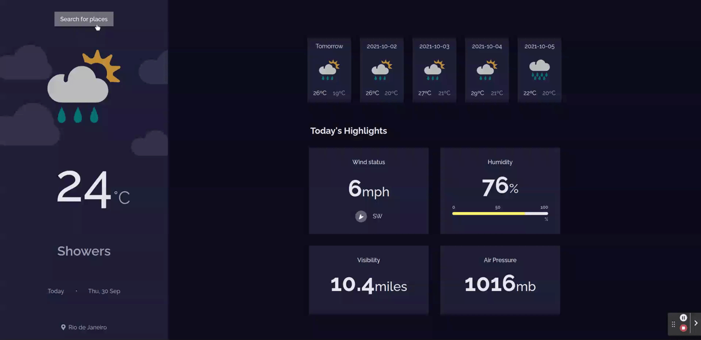

<h1 align="center">Weather App 🌤️</h1> 

<div align="center">
   Solution for a challenge from  <a href="http://devchallenges.io" target="_blank">Devchallenges.io</a>.
</div>
<br />

<div align="center">
  <h3>
    <a href="https://df-weather.vercel.app/">
      Demo
    </a>
    <span> | </span>
    <a href="https://devchallenges.io/solutions/lTI2yOoWgLNEoPZ5sk4G">
      Solution
    </a>
    <span> | </span>
    <a href="https://devchallenges.io/challenges/mM1UIenRhK808W8qmLWv">
      Challenge
    </a>
  </h3>
</div>

<!-- TABLE OF CONTENTS -->

## ✅ Table of Contents

- [✅ Table of Contents](#-table-of-contents)
- [✅ Overview](#-overview)
  - [👉 Built With](#-built-with)
- [✅ Features](#-features)
- [✅ How To Use](#-how-to-use)
- [✅ Contact](#-contact)

## ✅ Overview



### 👉 Built With

- [React](https://reactjs.org/)
- [Sass](https://sass-lang.com/)

## ✅ Features

- [x] I can search for city
- [x] I can see weather of today and the next 5 days
- [x] I can see the date and location of the weather
- [x] I can see according to image for each type of weather
- [x] I can see the min and max degree each day
- [x] I can see wind status and wind direction
- [x] I can see humidity percentage
- [x] I can see a visibility indicator
- [x] I can see the air pressure number

This application/site was created as a submission to a [DevChallenges](https://devchallenges.io/challenges) challenge. The [challenge](https://devchallenges.io/challenges/mM1UIenRhK808W8qmLWv) was to build an application to complete the given user stories.

## ✅ How To Use

To clone and run this application, you'll need [Git](https://git-scm.com) and [Node.js](https://nodejs.org/en/download/) (which comes with [npm](http://npmjs.com)) installed on your computer. From your command line:

```bash
# Clone this repository
$ git clone https://github.com/danielfilh0/weather-app

# Install dependencies
$ yarn install

# Run the app
$ yarn start
```

## ✅ Contact

- GitHub [@danielfilh0](https://github.com/danielfilh0)
- Linkedin [@danielfilh0](https://www.linkedin.com/in/danielfilh0/)
